# Informe de Auditoría de Sistemas  
## Examen de la Unidad I

**Nombres y apellidos: Piero Alexander Paja De la Cruz**  
**Fecha: 22/04/26**  
**URL GitHub: https://github.com/pieroalexanderppc/ExamenU1_Auditoria.git**  

---

## 1. Proyecto de Auditoría de Riesgos

### 🔐 Login
**Evidencia:**  
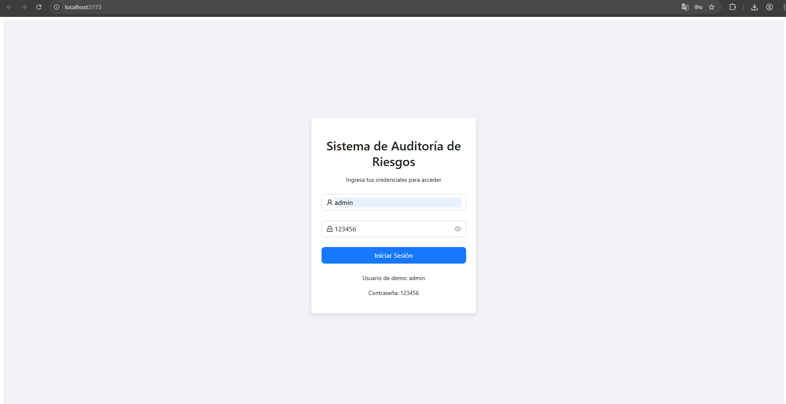
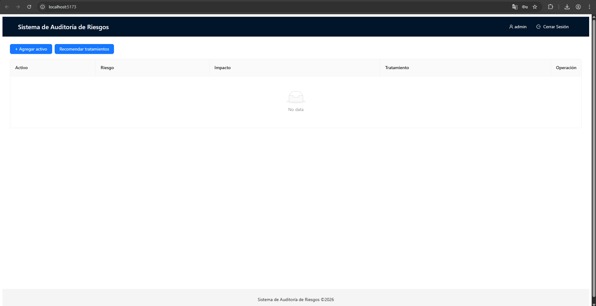

**Descripción:**  
Se implementó un inicio de sesión ficticio sin base de datos mediante credenciales hardcodeadas (usuario: admin, contraseña: 123456).  
La validación se realiza en el servicio `LoginService.js`, que genera un token simulado y lo almacena en `localStorage` para persistencia de sesión.  
El componente `App.jsx` protege la vista principal y renderiza `Login.jsx` cuando no existe sesión activa.

---

### 🤖 Motor de Inteligencia Artificial
**Evidencia:**  
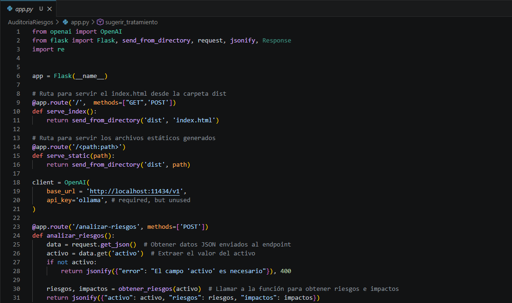
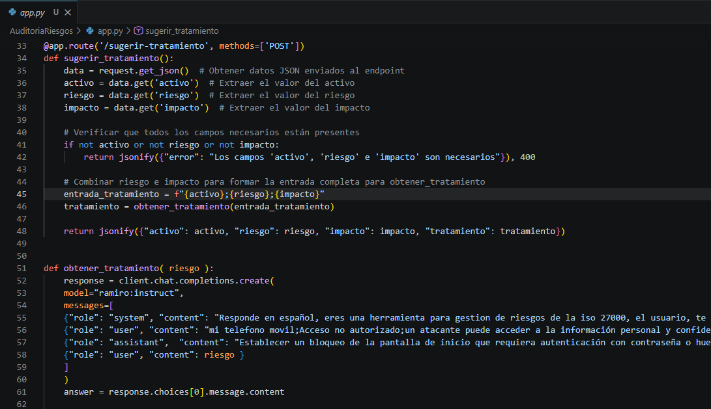
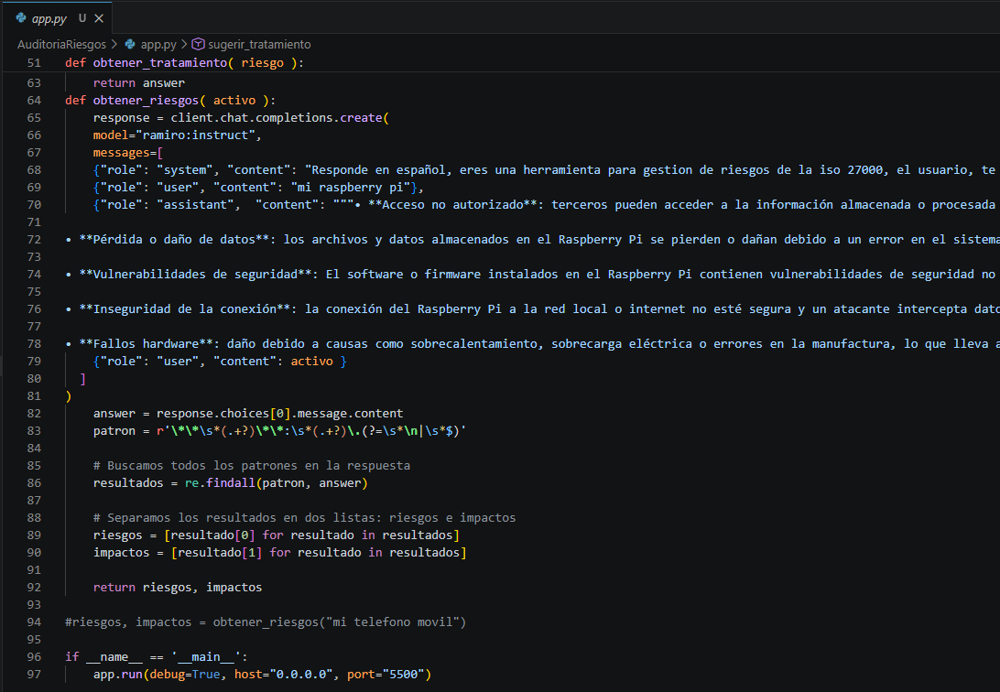

**Descripción:**  
Se mejoró el motor de IA integrando un backend Flask que consume un modelo de lenguaje local por Ollama, usando cliente compatible OpenAI (`base_url=http://localhost:11434/v1`).  
El endpoint `/analizar-riesgos` recibe un activo y devuelve lista de riesgos e impactos.  
El endpoint `/sugerir-tratamiento` recibe activo, riesgo e impacto, y responde con una recomendación de tratamiento alineada a gestión de riesgos ISO 27001.

---

## 2. Hallazgos

### Activo 1: Servidor de base de datos

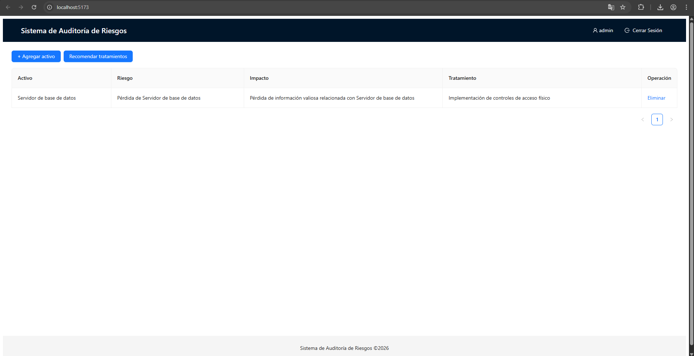

- **Evidencia:** Configuración sensible sin política explícita de rotación y endurecimiento; exposición potencial por credenciales y accesos no segmentados.  
- **Condición:** Riesgo de acceso no autorizado y alteración de datos críticos de clientes/transacciones.  
- **Recomendación:** Aplicar mínimo privilegio, segmentación de red, cifrado en reposo, rotación de credenciales y monitoreo continuo con alertas.  
- **Riesgo:** Alta.

### Activo 2: API Transacciones

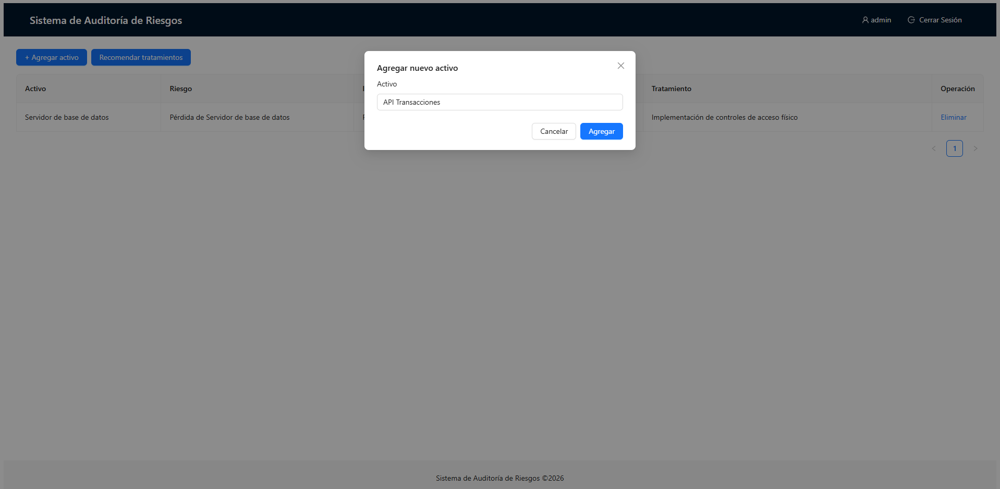
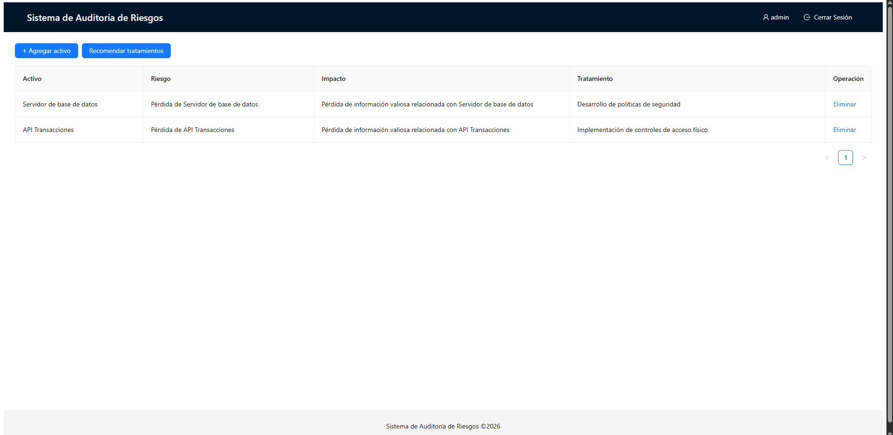

- **Evidencia:** Dependencia de tokens y servicios web para operaciones sensibles del negocio.  
- **Condición:** Un control deficiente de autenticación/autorización puede permitir fraude, suplantación o abuso de endpoints.  
- **Recomendación:** Implementar validación fuerte de tokens, rate limiting, registro de auditoría por operación y pruebas de seguridad API (OWASP API Top 10).  
- **Riesgo:** Alta.

### Activo 3: Autenticación MFA

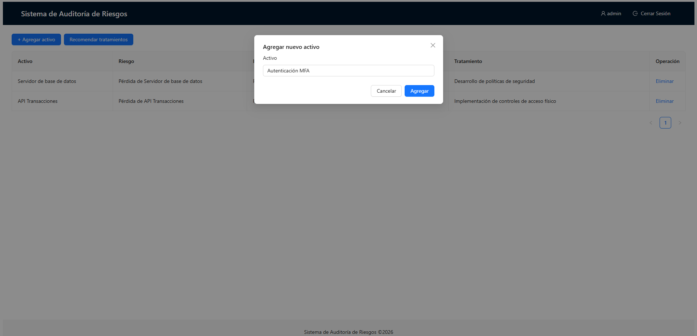
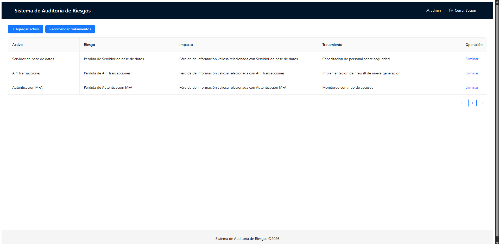

- **Evidencia:** La MFA está catalogada como activo crítico de seguridad en el entorno bancario.  
- **Condición:** Si la MFA falla o está mal configurada, se incrementa el riesgo de secuestro de cuentas y acceso a información financiera.  
- **Recomendación:** Exigir MFA para perfiles privilegiados y usuarios críticos, revisar políticas de enrolamiento y mecanismos antifraude para OTP/push.  
- **Riesgo:** Media-Alta.

### Activo 4: Registros de auditoría

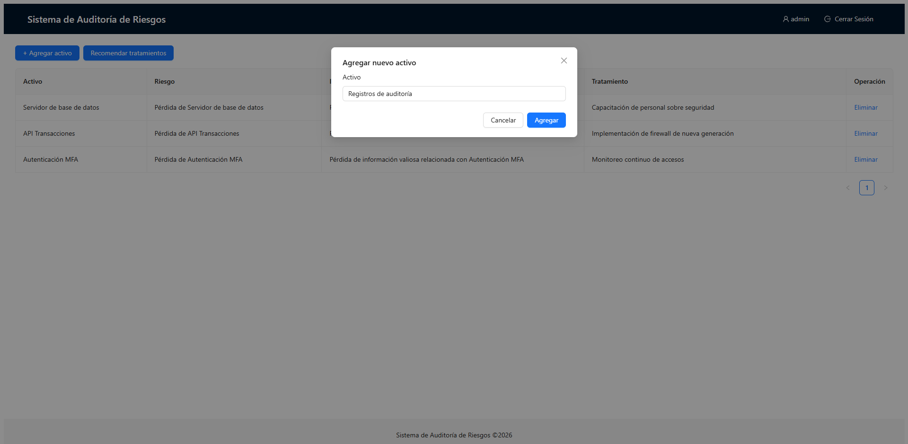
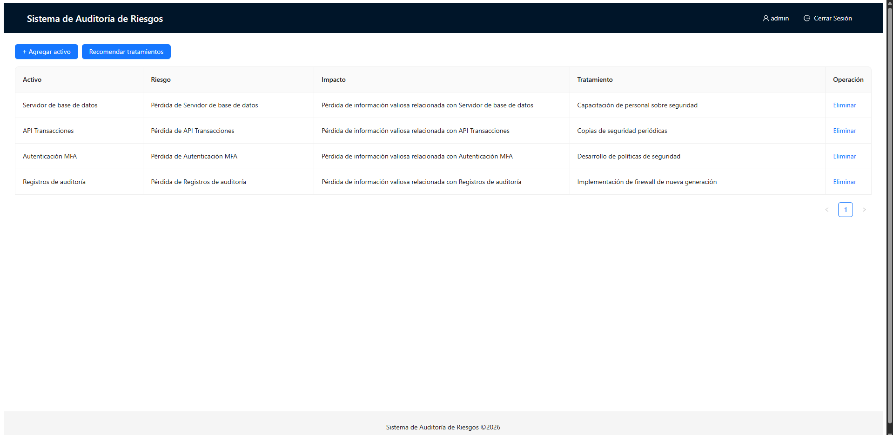

- **Evidencia:** Los logs son fuente principal para trazabilidad, detección de incidentes y cumplimiento normativo.  
- **Condición:** Registros incompletos o manipulables impiden reconstruir incidentes y afectan investigación forense.  
- **Recomendación:** Centralizar logs en SIEM, habilitar integridad/inmutabilidad, retención definida y correlación de eventos críticos.  
- **Riesgo:** Alta.

### Activo 5: Token de acceso a APIs

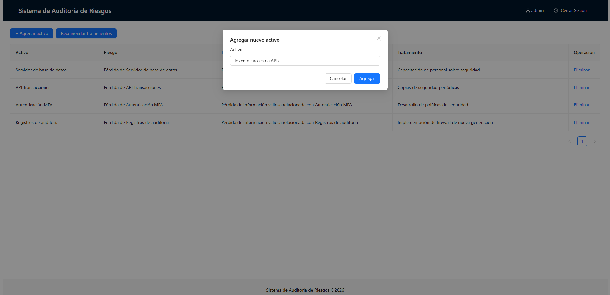
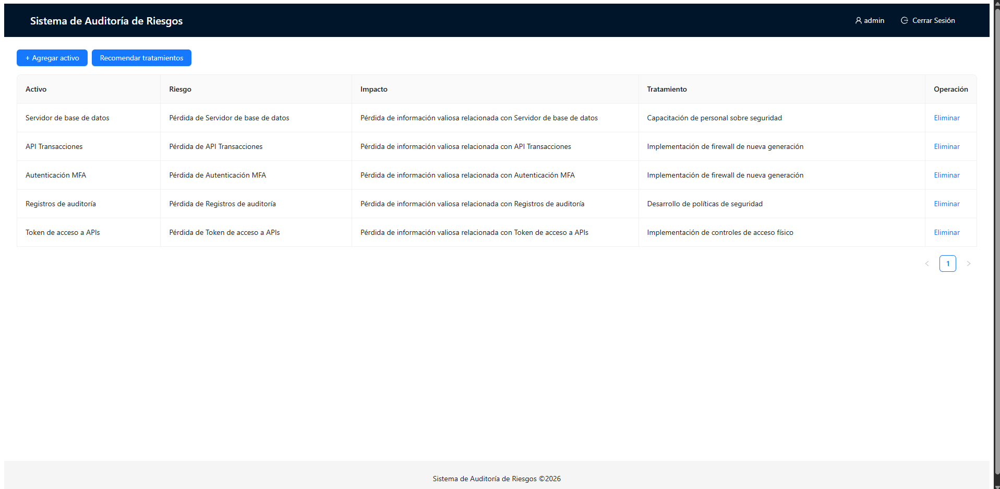

- **Evidencia:** Los tokens otorgan acceso directo a servicios financieros y procesos automatizados.  
- **Condición:** Exposición de tokens por mala custodia o configuración puede derivar en compromiso total de APIs.  
- **Recomendación:** Usar bóveda de secretos, expiración corta, rotación automática, scopes mínimos y revocación inmediata ante incidentes.  
- **Riesgo:** Alta.

---

## 3. Conclusiones de Auditoría

1. Se implementó correctamente el inicio de sesión ficticio sin base de datos para fines académicos del examen.  
2. Se incorporó un motor de IA local para análisis de riesgos y recomendación de tratamientos, cumpliendo el requerimiento de automatización.  
3. Los cinco activos evaluados presentan riesgos relevantes para confidencialidad, integridad y disponibilidad; se prioriza remediación inmediata en API, base de datos, logs y gestión de tokens.  
4. Las recomendaciones propuestas se alinean a controles de ISO 27001 (control de acceso, gestión de eventos, gestión de credenciales y monitoreo).
